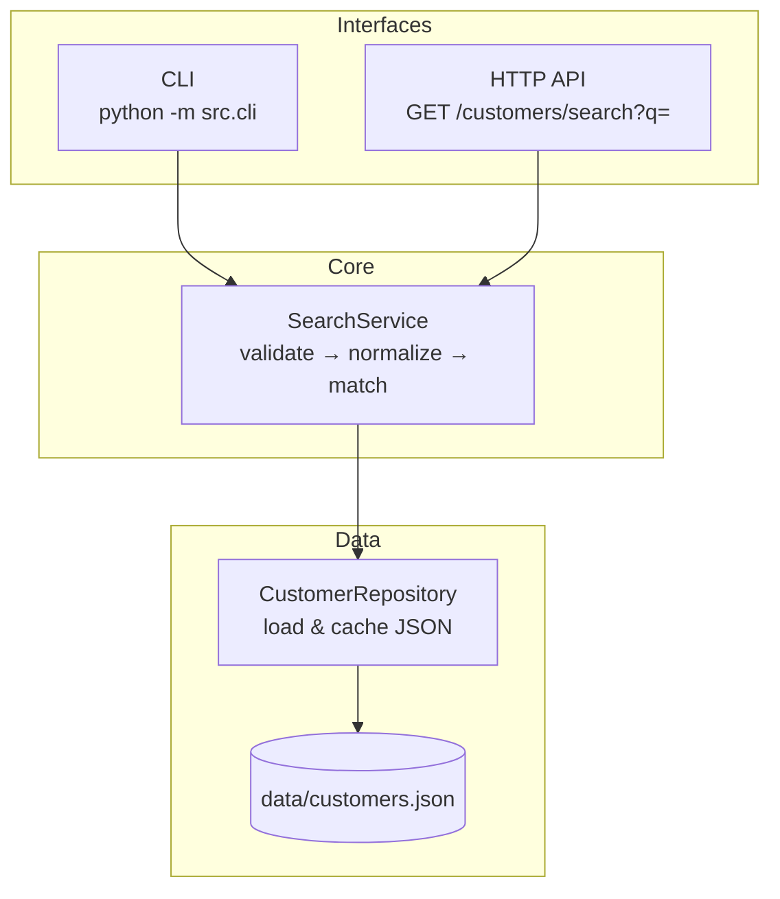
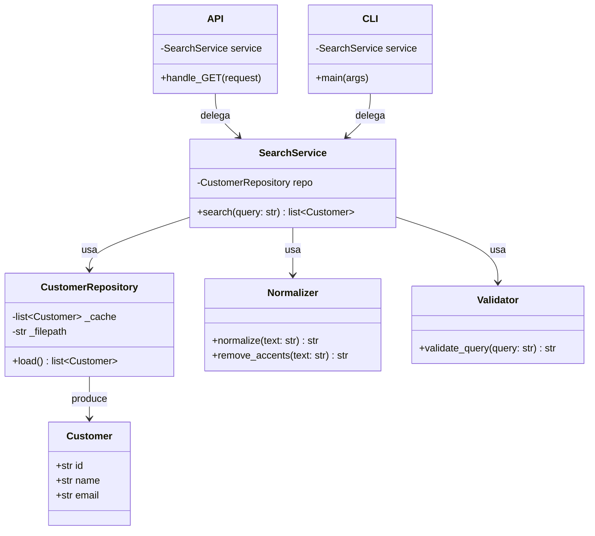
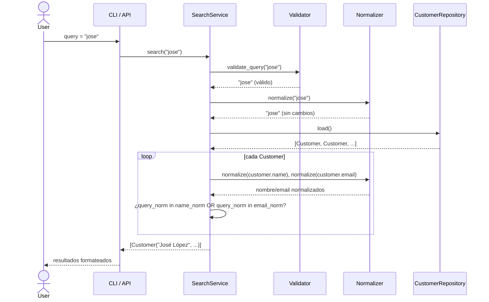
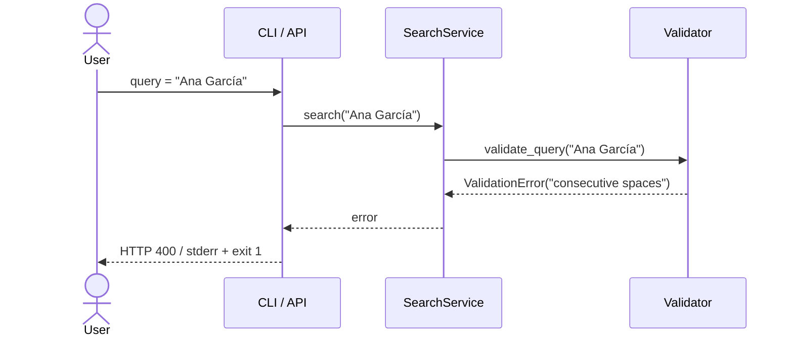

# Architecture — Customer Search

> ADA-05 · Ingeniería de Software asistida por IA · UADY
>
> Basado en [`SPEC.md`](./SPEC.md) y [`REQUIREMENTS.md`](./REQUIREMENTS.md).

---

## Overview

Arquitectura en **3 capas** (interfaces → servicio → datos) con un módulo central de búsqueda reutilizable. Las dos interfaces (CLI y HTTP API) son adaptadores delgados que delegan toda la lógica al servicio; esto garantiza que validación, normalización y búsqueda se implementan **una sola vez** (FR-10, NFR-02).



---

## Components

| Componente | Archivo | Descripción |
|-----------|---------|-------------|
| **Customer** (model) | `src/models.py` | Dataclass con campos `id`, `name`, `email`. |
| **CustomerRepository** | `src/repository.py` | Carga `data/customers.json`, parsea a lista de `Customer`, cachea en memoria. |
| **SearchService** | `src/service.py` | Punto central: valida query → normaliza → filtra registros → devuelve resultados. |
| **Normalizer** | `src/normalizer.py` | Funciones puras: `strip`, `remove_accents` (NFD + strip diacritics), `lowercase`. |
| **Validator** | `src/validator.py` | Funciones puras: `validate_query()` lanza `ValidationError` si el input es inválido. |
| **HTTP Handler** | `src/api.py` | Servidor HTTP (stdlib `http.server`). Expone `GET /customers/search?q=`. |
| **CLI** | `src/cli.py` | Entry point CLI. Parsea args, imprime resultados o errores. |

---

## Responsibilities



| Componente | Responsabilidad única |
|-----------|----------------------|
| **Customer** | Representar un registro de cliente (solo datos, sin lógica). |
| **CustomerRepository** | Leer y cachear datos del JSON. No sabe de búsquedas ni validación. |
| **Normalizer** | Transformar texto: quitar acentos, lowercase. No decide qué es válido. |
| **Validator** | Decidir si un query es válido. No transforma ni busca. |
| **SearchService** | Orquestar: validar → normalizar → buscar → devolver. No conoce HTTP ni CLI. |
| **API** | Traducir HTTP ↔ SearchService. No contiene lógica de negocio. |
| **CLI** | Traducir argv/stdout ↔ SearchService. No contiene lógica de negocio. |

---

## Data Flow

### Búsqueda exitosa



### Validación fallida



---

## Interfaces

### HTTP API (NFR-02)

| Método | Ruta | Params | Éxito | Error |
|--------|------|--------|-------|-------|
| `GET` | `/customers/search` | `q` (query string, requerido) | `200` — `{"results": [...], "count": N}` | `400` — `{"error": "mensaje"}` |

**Ejemplo:**
```
GET http://localhost:8000/customers/search?q=jose

200 OK
{
  "results": [
    {"id": "e5f6g7h8", "name": "José López", "email": "jose.lopez@example.com"}
  ],
  "count": 1
}
```

### CLI (NFR-02)

```
Usage: python -m src.cli <query>

  Éxito (exit 0):
    Found 2 customer(s):
      [a1b2c3d4] María García — maria.garcia@example.com
      [e5f6g7h8] José López  — jose.lopez@example.com

  Sin resultados (exit 0):
    No customers found.

  Error de validación (exit 1):
    Error: Query must not contain consecutive spaces
```

---

## Error Handling

| Capa | Error | Acción |
|------|-------|--------|
| **Validator** | Query vacío / solo espacios | Lanza `ValidationError("Query must not be empty")` |
| **Validator** | Doble espacio | Lanza `ValidationError("Query must not contain consecutive spaces")` |
| **SearchService** | `ValidationError` recibido | Lo propaga a la interfaz sin modificar |
| **Repository** | `FileNotFoundError` | Lanza `DataError("Customer data file not found")` |
| **API** | `ValidationError` | Responde `400 {"error": msg}` |
| **API** | `DataError` | Responde `500 {"error": msg}` |
| **API** | Excepción inesperada | Responde `500 {"error": "Internal server error"}` |
| **CLI** | `ValidationError` | Imprime en stderr, exit code 1 |
| **CLI** | `DataError` | Imprime en stderr, exit code 1 |

Excepciones custom definidas en `src/exceptions.py`:
```python
class ValidationError(Exception): ...
class DataError(Exception): ...
```

---

## Testing Strategy

| Nivel | Qué se testea | Herramienta | Test Scenarios |
|-------|---------------|-------------|----------------|
| **Unit** | `Normalizer` — accent/case removal | `pytest` | TS-03, TS-04 |
| **Unit** | `Validator` — rechazo de inputs inválidos | `pytest` | TS-07, TS-08, TS-09 |
| **Unit** | `SearchService.search()` — lógica de matching | `pytest` | TS-01, TS-02, TS-05, TS-06 |
| **Integration** | HTTP API — requests contra servidor levantado | `pytest` + `urllib` | TS-11, TS-12 |
| **Integration** | CLI — subprocess con captura de stdout/stderr | `pytest` + `subprocess` | TS-13, TS-14 |
| **Performance** | 1 000 registros en ≤ 200 ms | `pytest` + `time` | TS-10 |
| **Coverage** | ≥ 90 % en `src/` | `pytest-cov` | TS-15 |

**Comando:**
```bash
pytest tests/ --cov=src --cov-report=term-missing
```

---

## Dependencies

| Dependencia | Tipo | Uso |
|-------------|------|-----|
| Python 3.10+ | Runtime | Lenguaje base |
| `json` (stdlib) | Stdlib | Parseo de `data/customers.json` |
| `http.server` (stdlib) | Stdlib | Servidor HTTP para la API |
| `unicodedata` (stdlib) | Stdlib | Normalización NFD para quitar acentos |
| `re` (stdlib) | Stdlib | Detección de espacios consecutivos |
| `dataclasses` (stdlib) | Stdlib | Definición del modelo `Customer` |
| `pytest` | Dev | Framework de tests |
| `pytest-cov` | Dev | Reporte de cobertura |

> **Cero dependencias externas en producción.** Solo `pytest` y `pytest-cov` como dependencias de desarrollo (SPEC C-02).

---

## Design Decisions

| #  | Decisión | Alternativa descartada | Motivo |
|----|----------|----------------------|--------|
| DD-1 | Validación server-side (en `SearchService`) | Validación en cliente (CLI/API) | Fuente única de verdad; seguridad; testeabilidad. Ver `AI_USAGE_LOG.md` entrada 2. |
| DD-2 | stdlib `http.server` en vez de Flask/FastAPI | Flask, FastAPI | Cero dependencias externas; proyecto académico pequeño; cumple NFR-02. |
| DD-3 | Normalización con `unicodedata.normalize('NFD')` + strip diacritics | Librerías como `unidecode` | Sin dependencias externas; estándar Unicode; suficiente para español y lenguas latinas. |
| DD-4 | Datos en JSON local + cache en memoria | SQLite, TinyDB | Simplicidad; cumple C-01 y A-01 (≤ 1 000 registros); lectura única al inicio. |
| DD-5 | Excepciones custom (`ValidationError`, `DataError`) | Retornar tuplas `(ok, error)` | Patrón Pythonic; permite `try/except` limpio en las interfaces; separación clara de flujo normal vs. errores. |
| DD-6 | `Normalizer` como módulo de funciones puras (sin clase) | Clase `Normalizer` con estado | No hay estado que mantener; funciones puras son más fáciles de testear y componer. |

---

## Trade-offs

| Trade-off | A favor | En contra | Justificación |
|-----------|---------|-----------|---------------|
| **JSON local vs. DB** | Simple, sin setup, portable | No escala más allá de ~10K registros; sin índices | Dataset ≤ 1 000 (A-01); proyecto académico. Si escala, migrar a SQLite es directo. |
| **stdlib HTTP vs. framework** | Cero deps; aprendizaje de bajo nivel | Sin routing automático, sin middlewares, más código boilerplate | Solo 1 endpoint; complejidad manejable. |
| **Cache en memoria (todo el JSON)** | Lecturas O(1) después de la carga; búsqueda O(n) simple | Usa memoria proporcional al dataset | Con ≤ 1 000 registros (~100 KB), el costo es despreciable. |
| **Búsqueda lineal O(n) vs. índice invertido** | Implementación trivial; correcta para n ≤ 1 000 | No escala a millones | NFR-01 pide ≤ 200 ms para 1 000 registros; O(n) lo cumple sobrado. |
| **Accent-insensitive via NFD strip vs. lookup table** | Genérica para cualquier carácter Unicode | Ligeramente más lenta que lookup table | Diferencia despreciable en n ≤ 1 000; más mantenible. |
